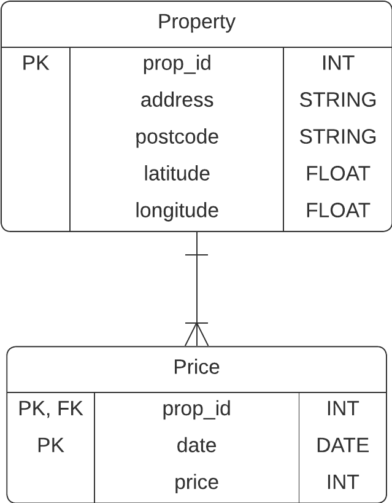
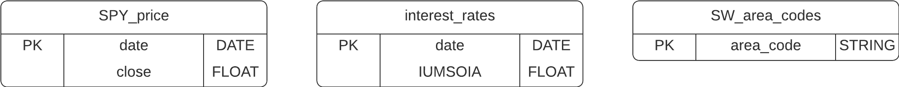
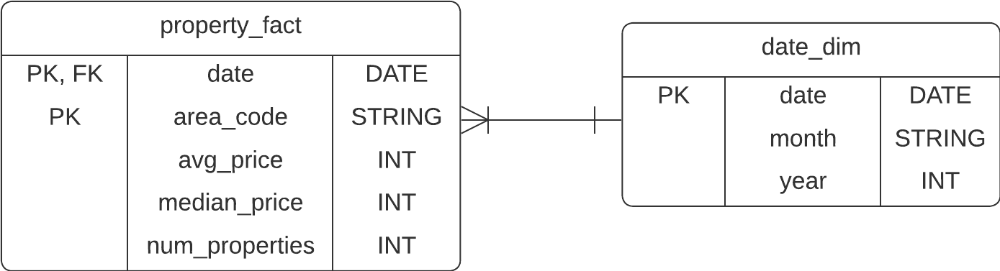
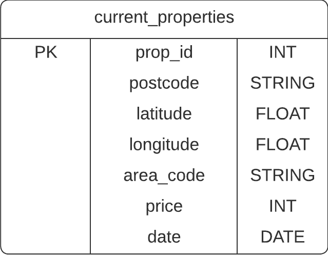

# An end-to-end data pipeline for housing market analysis using Rightmove

Problem/business statement: We want to extract data from Rightmove.com to analyse the trends in the rental costs of 2-bed properties in South West London. In particular, we want to analyse trends over time and geographically within the SW London area.

In this project, I have used Selenium to get data from the Rightmove webpage. I then load it into a relational database (SQL Server on AWS RDS) with a normalised, orthogonal data maodel. Following this, I will use the data in the database to build a dashboard for analysis.

## Extract

### Property Data - Web Scraping Rightmove and using the Google and/or Bing API

Webscraping using Selenium in python.

- Class `Data` used to temporarily store the data upon extraction and hold all the necessary functionality to tranform the data before loading into our relational database.
  - Method `add_page_data(driver)` used to add data from the current webpage, given the selenium `driver` (using Chrome driver).

Currently we are scraping from this base url: <https://www.rightmove.co.uk/property-to-rent/find.html?locationIdentifier=REGION%5E92829&maxBedrooms=2&minBedrooms=2&propertyTypes=&includeLetAgreed=false&mustHave=&dontShow=&furnishTypes=&keywords=>  
This corresponds to 2 bed properties in South-West London available to rent, which defines the properties of interest for this problem.

We are currently scraping 3 pieces of data for each property using Selenium:

1. Property id (natural key). You should always make sure you have a way to uniquely identify an entity (i.e. property) to avoid duplication. In this case it is certainly important as some properties are 'featured' and can appear on multiple pages meaning their data will be scraped multiple times. Having property id data means we can enforce a uniqueness constraint on the id in our RDMS to avoid duplication on loading. This piece of data is found in the "id" attribute of \<a> tags for each property with the class name "propertyCard-anchor".
2. Price. This is the monthly rental cost of the property. It can be found in the text of the \<span> tags with the class name "propertCard-priceValue".
3. Address. This is the address of the property. It can be found in the "title" attribute of the \<address> tags with the class name "propertCard-address".

In order to scrape the data using Selenium, we use the Chrome driver (through Selenium) to interact with the webpage. First, we may need to accept cookies so we have added a function `accept_cookies_if_asked()` to find the button on the pop-up up by id and click, if it exists and is clickable.

We also need to click through all available pages of properties to make sure we have the complete dataset. To do this, we search for the button using:

```python
button = driver.find_element(By.XPATH, "//button[@title='Next page']")
```

This searches for a button element with title attribute "Next page". Which is the one we want on Rightmove! Once we have found that, we can click the button to navaigate to the next page

```python
button.click()
```

We carry out this process in a while loop, looping through all pages with the handy condition `button.is_enabled()`. We can use this condition because, on the final page, the button still exists in the html but is disabled.

Due to the nature of the driver. We need to enforce some waits in to our code, specifically we need to wait until the 'next page' button is clickable (loaded) before trying to click it:

```python
WebDriverWait(driver, 20).until(EC.element_to_be_clickable(button))
```

and we need to wait until the html elements we need are available (loaded) before trying to scrape them:

```python
WebDriverWait(driver, 20).until(EC.presence_of_element_located((By.CLASS_NAME, 'propertyCard-anchor')))
```

### Financial Data - Bank of England data source and Yahoo Finance (yfinance) python package

The analysis is supplemented with financial indicators. For now we have simply chosen

1. Interest rate indicator - the bank of Englands [SONIA benchmark indicator](https://www.bankofengland.co.uk/markets/sonia-benchmark)
2. Stock market indicator - the S&P500

All required functionality is included in the `ETL.financials` module.

The bank of england supply csv data which can be accessed using a url of the form:
<https://www.bankofengland.co.uk/boeapps/iadb/fromshowcolumns.asp?csv.x=yes&Datefrom={prev_day}%2F{prev_month}%2F{prev_year}&Dateto={curr_day}%2F{curr_month}%2F{curr_year}&SeriesCodes=IUMSOIA&CSVF=TN&UsingCodes=Y&VPD=Y&VFD=N>
and is updated monthly (so we can take the data as often as is available without overcluttering our database).
The function `get_interest_rates()` takes in the current date and previuos date (accessed from the database as the date of last loading), loads the csv into a dataframe and transforms it into the list of tuples required to load the data.

- NOTE: it was found that the url did not work unless we had previously opened the url. [A similar problem](https://stackoverflow.com/questions/70792547/fom-browser-a-csv-file-from-url-url-1-can-be-downloaded-only-if-another-url-of) has been found previously. It appears that we first need to access the page to set cookies. The function `access_url()` is added for that purpose.

The function `get_spy_price()` uses the [yfinance](https://pypi.org/project/yfinance/) package to get the most recent (initially gets 5 days incase of closures, then choses most recent) SPY close price (SPY is an S&P500 ETF). It also makes the necessary transformations to the date and price.

## Transform

- The price is in the text form "£X,XXX pcm" where X are numbers. We add a method to our `Data` class, `.transform_prices()` which transforms the `prices` attribute from a list of strings into a list of integers (without "£", " pcm" and commas).
- The location given on the rightmove page is inconsistent and often without a postcode :angry:. For now, we use the [bing maps api](https://learn.microsoft.com/en-us/bingmaps/rest-services/locations/find-a-location-by-query). This allows us to pass the address scraped to get info such as the postcodes. However, the api doesn't always return a postcode in the json response (maybe try a different api if it becomes a problem - google looks promising but requires card details). So far, it has seemed to always return coordinates. So we are adding postcodes where possible and adding geolocation coordiantes (latitude and longitude) to all properties. The method `transform_location_data_bing()` is added to the `Data` class to fill in the geolocation attributes. We also add ' London, UK' to the address search to remove potential ambiguity.
  - A new method `transform_location_data_google()` has now been added to use the [google maps api](https://developers.google.com/maps/documentation/geocoding/overview). This appears to provide better results. It does still get the wrong address sometimes, but only seems to error when there are similar addresses elsewhere in London - hence the addition of ' London, UK' to the address search is effective. The response from the google api is slightly unhelpful in that the postcode identifier ("postal_code") is not a key but rather a value in a list. So we have to loop through components until we find the postcode identifier, if it exists, for each property.
- The methods `zip_properties()` and `zip_price()` to the `Data` class return a list of tuples of the data required to load into the tables, as required for use of the pyodbc driver. The current date is added along with the price data.
  - Within these methods, we also put in place any measures to ensure that the data does not conflict with the database schema (removing "prop" from the ids, converting datatypes, lengths of strings, decimal places etc.)

## Load

After extracting and transforming, the data is loaded into the SQL Server database using the [pyodbc driver](https://pypi.org/project/pyodbc/).

- `ETL.load.connect_to_db()` connects to the database using the `pyodbc.connect()` method and returns the connection object `conn`.
- `ETL.load.load_data(conn, query, data)` loads the data, `data` (a list of tuples) using the connection, `conn`, by creating a `cursor` object using `conn.cursor()` and writing the `data` through a SQL `query` using the [`cursor.executemany()` method](https://dev.mysql.com/doc/connector-python/en/connector-python-api-mysqlcursor-executemany.html)
  - `cursor.commit()` and `cursor.close()` <- very important (commit to actually commit to the database and then close your cursor)
  - Within the queries to load the data, a cte is used to initially reference the data in the `data` list. Then, the data can be inserted into the table using the cte and a subquery to ensure that we only load new data i.e. obey primary key constraint.

## Data Models

### Database

Properties and prices tables:



Misc tables - Finance tables and area codes for SW London (used to filter address' where the API was mistaken):



### Data-mart/analytical table (to be loaded into dataviz tools)

Aggregated historical price data:



Table of data for the most recent/currently available properties:



The SQL used to create the analytical tables is contained in /sql_snippets/create_dm_tables.sql

## Dashboard
