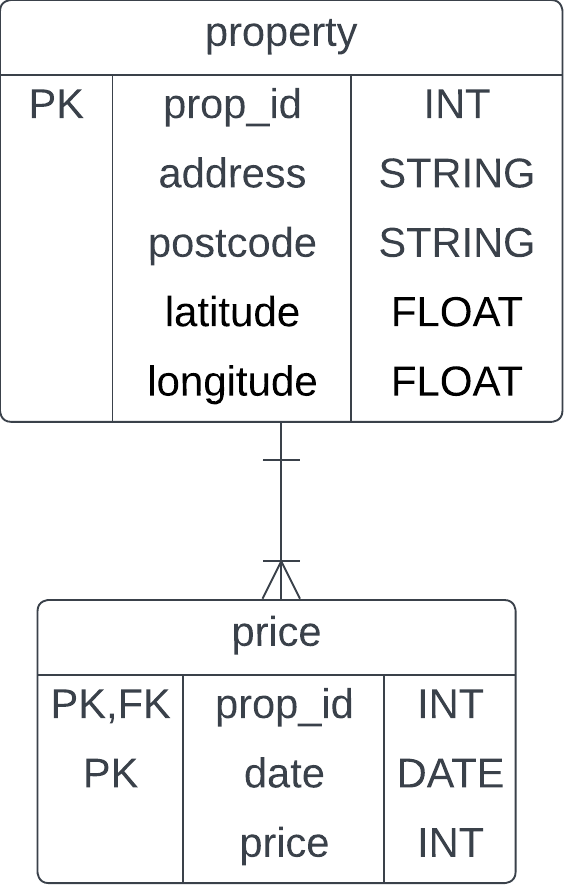
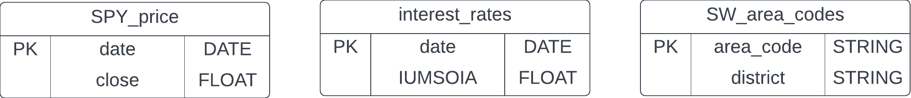
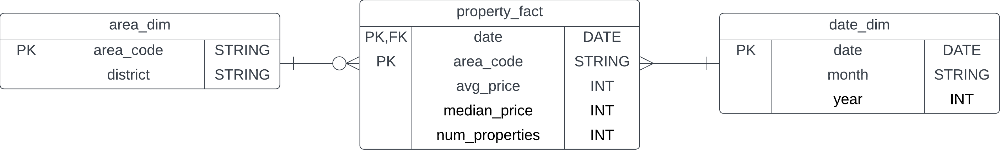
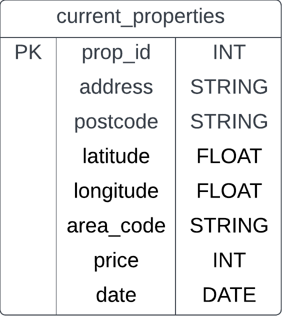
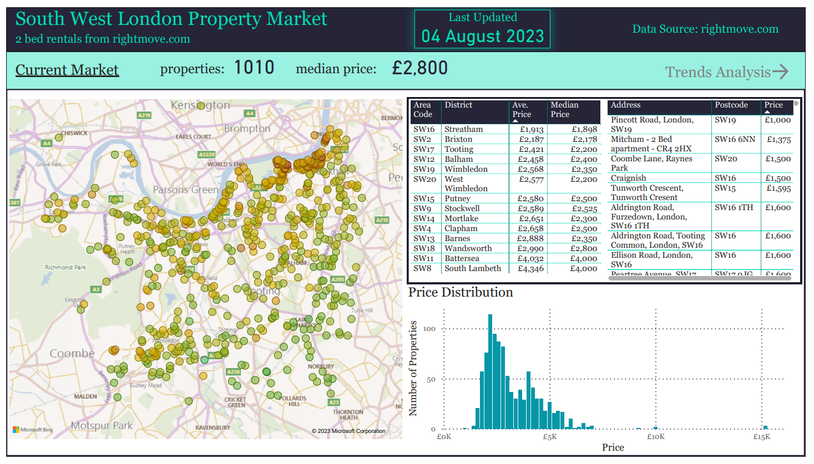
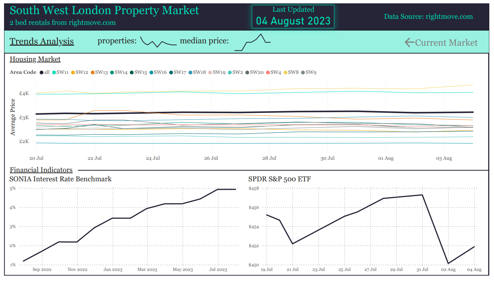
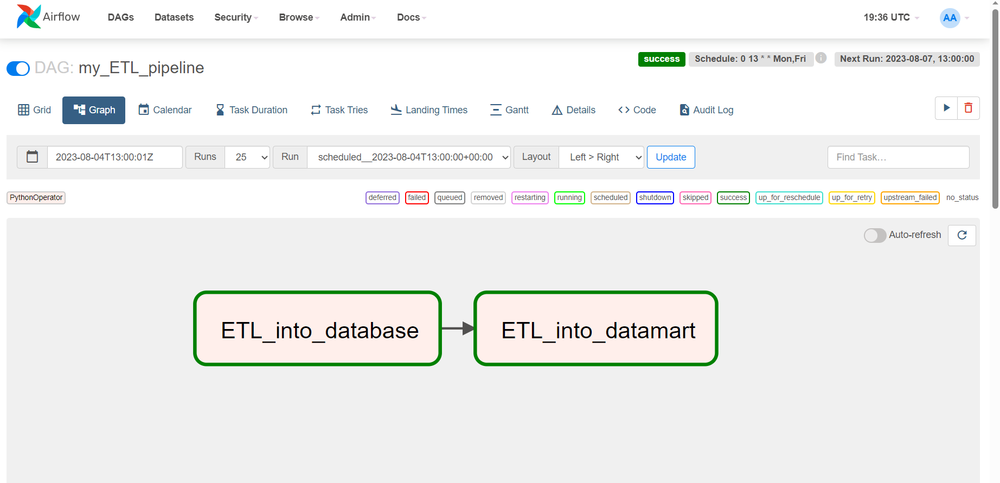
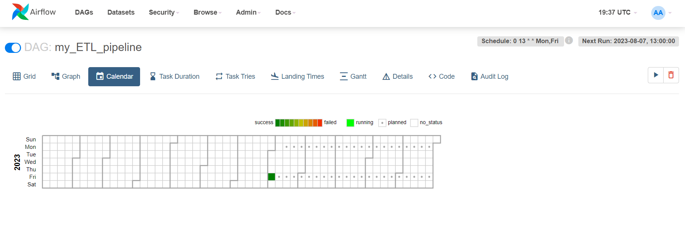

# An end-to-end data pipeline for housing market analysis using Rightmove

Problem/business statement: We want to extract data from Rightmove.com to analyse the trends in the rental costs of 2-bed properties in South West London. In particular, we want to analyse trends over time and geographically within the SW London area.

In this project, I have used Selenium to get data from the Rightmove webpage. I then load it into a relational database (SQL Server on AWS RDS) with a normalised, orthogonal data maodel. Following this, I will use the data in the database to build a dashboard for analysis.

---

## Set up a database

SUPER EASY!!!! AWS RDS - [free tier](https://aws.amazon.com/rds/free/) :
1. Go to AWS RDS
2. Click 'create database'
3. Use the 'easy create' option
4. Choose your desired engine i.e. Microsoft SQL Server
5. Select 'free tier' for your DB instance size
6. Give it a name (DB instance identifier) - this is just used to identify it within AWS
7. Set your master username and password
8. Hit 'create database' and wait for it to be created
9. As always, check your inbound/outbound security group rules attached to the RDS instance and update to ensure you can access it with your (or any) IP address
10. All done - all you need now to connect and start using your database (i.e. from SQL Server management studio) is your database endpoint (in the 'connectivity & security' tab) and the username and password you set up.

OR set up on your local machine: 
- <https://learn.microsoft.com/en-us/sql/database-engine/install-windows/install-sql-server?view=sql-server-ver16>
- <https://www.youtube.com/watch?v=835Zubb1vuU>
- Notes:
  - Default port is 1433. Will need to check inbound rules on your machine, e.g. in windows defender firewall for windows pc.
  - Can check ip address and enable in 'Sql Server Configuration Manager'. Go to 'protocols for \<instance name (default is MSSQLSERVER)\>'. Enable TCP/IP and click to Check IP addresses and ports, under 'enabled' select 'yes' for e.g. IP10. Once configuration changed, restart the instance in the 'SQL Server Services' tab by right clicking and selecting 'restart'.
  - When connecting, you can specify the port in the connection string: \<ip address\>,\<port\>

---

## Extract

### Property Data - Web Scraping Rightmove and using the Google and/or Bing API

Webscraping using Selenium in python.

- Class `Data` used to temporarily store the data upon extraction and hold all the necessary functionality to tranform the data before loading into our relational database.
  - Method `add_page_data(driver)` used to add data from the current webpage, given the selenium `driver` (using Chrome driver).

Currently we are scraping from this base url: <https://www.rightmove.co.uk/property-to-rent/find.html?locationIdentifier=REGION%5E92829&maxBedrooms=2&minBedrooms=2&propertyTypes=&includeLetAgreed=false&mustHave=&dontShow=&furnishTypes=&keywords=>  
This corresponds to 2 bed properties in South-West London available to rent, which defines the properties of interest for this problem.

We are currently scraping 3 pieces of data for each property using Selenium:

1. Property id (natural key). You should always make sure you have a way to uniquely identify an entity (i.e. property) to avoid duplication. In this case it is certainly important as some properties are 'featured' and can appear on multiple pages meaning their data will be scraped multiple times. Having property id data means we can enforce a uniqueness constraint on the id in our RDMS to avoid duplication on loading. This piece of data is found in the "id" attribute of \<a> tags for each property with the class name "propertyCard-anchor".
2. Price. This is the monthly rental cost of the property. It can be found in the text of the \<span> tags with the class name "propertCard-priceValue".
3. Address. This is the address of the property. It can be found in the "title" attribute of the \<address> tags with the class name "propertCard-address".

In order to scrape the data using Selenium, we use the Chrome driver (through Selenium) to interact with the webpage. First, we may need to accept cookies so we have added a function `accept_cookies_if_asked()` to find the button on the pop-up up by id and click, if it exists and is clickable.

We also need to click through all available pages of properties to make sure we have the complete dataset. To do this, we search for the button using:

```python
button = driver.find_element(By.XPATH, "//button[@title='Next page']")
```

This searches for a button element with title attribute "Next page". Which is the one we want on Rightmove! Once we have found that, we can click the button to navaigate to the next page

```python
button.click()
```

We carry out this process in a while loop, looping through all pages with the handy condition `button.is_enabled()`. We can use this condition because, on the final page, the button still exists in the html but is disabled.

Due to the nature of the driver. We need to enforce some waits in to our code, specifically we need to wait until the 'next page' button is clickable (loaded) before trying to click it:

```python
WebDriverWait(driver, 20).until(EC.element_to_be_clickable(button))
```

and we need to wait until the html elements we need are available (loaded) before trying to scrape them:

```python
WebDriverWait(driver, 20).until(EC.presence_of_element_located((By.CLASS_NAME, 'propertyCard-anchor')))
```

### Financial Data - Bank of England data source and Yahoo Finance (yfinance) python package

The analysis is supplemented with financial indicators. For now we have simply chosen

1. Interest rate indicator - the bank of Englands [SONIA benchmark indicator](https://www.bankofengland.co.uk/markets/sonia-benchmark)
2. Stock market indicator - the S&P500

All required functionality is included in the `ETL.financials` module.

The bank of england supply csv data which can be accessed using a url of the form:
<https://www.bankofengland.co.uk/boeapps/iadb/fromshowcolumns.asp?csv.x=yes&Datefrom={prev_day}%2F{prev_month}%2F{prev_year}&Dateto={curr_day}%2F{curr_month}%2F{curr_year}&SeriesCodes=IUMSOIA&CSVF=TN&UsingCodes=Y&VPD=Y&VFD=N>
and is updated monthly (so we can take the data as often as is available without overcluttering our database).
The function `get_interest_rates()` takes in the current date and previuos date (accessed from the database as the date of last loading), loads the csv into a dataframe and transforms it into the list of tuples required to load the data.

- NOTE: it was found that the url did not work unless we had previously opened the url. [A similar problem](https://stackoverflow.com/questions/70792547/fom-browser-a-csv-file-from-url-url-1-can-be-downloaded-only-if-another-url-of) has been found previously. It appears that we first need to access the page to set cookies. The function `access_url()` is added for that purpose.

The function `get_spy_price()` uses the [yfinance](https://pypi.org/project/yfinance/) package to get the most recent (initially gets 5 days incase of closures, then choses most recent) SPY close price (SPY is an S&P500 ETF). It also makes the necessary transformations to the date and price.

## Transform

- The rental price is in the text form "£X,XXX pcm" where X are numbers. We add a method to our `Data` class, `.transform_prices()` which transforms the `prices` attribute from a list of strings into a list of integers (without "£", " pcm" and commas).
- The location given on the rightmove page is inconsistent and often without a postcode :angry:. For now, we use the [bing maps api](https://learn.microsoft.com/en-us/bingmaps/rest-services/locations/find-a-location-by-query). This allows us to pass the address scraped to get info such as the postcodes. However, the api doesn't always return a postcode in the json response (maybe try a different api if it becomes a problem - google looks promising but requires card details). So far, it has seemed to always return coordinates. So we are adding postcodes where possible and adding geolocation coordiantes (latitude and longitude) to all properties. The method `transform_location_data_bing()` is added to the `Data` class to fill in the geolocation attributes. We also add ' London, UK' to the address search to remove potential ambiguity.
  - A new method `transform_location_data_google()` has now been added to use the [google maps api](https://developers.google.com/maps/documentation/geocoding/overview). This appears to provide better results. It does still get the wrong address sometimes, but only seems to error when there are similar addresses elsewhere in London - hence the addition of ' London, UK' to the address search is effective. The response from the google api is slightly unhelpful in that the postcode identifier ("postal_code") is not a key but rather a value in a list. So we have to loop through components until we find the postcode identifier, if it exists, for each property.
- The methods `zip_properties()` and `zip_price()` to the `Data` class return a list of tuples of the data required to load into the tables, as required for use of the pyodbc driver. The current date is added along with the price data.
  - Within these methods, we also put in place any measures to ensure that the data does not conflict with the database schema (removing "prop" from the ids, converting datatypes, lengths of strings, decimal places etc.)

## Load

After extracting and transforming, the data is loaded into the SQL Server database using the [pyodbc driver](https://pypi.org/project/pyodbc/).

- `ETL.load.connect_to_db()` connects to the database using the `pyodbc.connect()` method and returns the connection object `conn`.
- `ETL.load.load_data(conn, query, data)` loads the data, `data` (a list of tuples) using the connection, `conn`, by creating a `cursor` object using `conn.cursor()` and writing the `data` through a SQL `query` using the [`cursor.executemany()` method](https://dev.mysql.com/doc/connector-python/en/connector-python-api-mysqlcursor-executemany.html)
  - `cursor.commit()` and `cursor.close()` <- very important (commit to actually commit to the database and then close your cursor)
  - Within the queries to load the data, a cte is used to initially reference the data in the `data` list. Then, the data can be inserted into the table using the cte and a subquery to ensure that we only load new data i.e. obey primary key constraint.

---

## Data Models

### Database

Properties and prices tables:



Misc tables - Finance tables and area codes for SW London (used to filter address' where the API was mistaken):



### Data-mart/analytical table (to be loaded into dataviz tools)

The purpose of the data-mart is to take away some if the burden of performing aggregations in PowerBI and, more importantly, to limit the amount of data we have to load into PowerBI - saving (a) having to load large amounts of data or (b) having to direct query the database.

Aggregated historical price data:



Table of data for the most recent/currently available properties:



- The SQL used to create the analytical tables is contained in /sql_snippets/create_dm_tables.sql
- The SQL used to create the stored procedure to be executed to update the analytical tables with new data is in /sql_snippets/create_procedure.sql 

---

## Dashboard

The dashboard imports data from our analytical tables and from there is fairly straightforward. Two things worth noting:

1. There doesn't seem to be a histogram visual in PowerBI (hmm). To generate the price distribution histogram I created a new column with the DAX below to manually bin the prices into groups of £200 and then plotted it on a bar chart against the count:

```DAX
binned_price = ROUND(current_properties[price]/200, 0) * 200
```

2. The current_properties table doesn't have a relationship to the area_dim table as not all properties in the table have an area code and we would violate foreign key constraints. However, we can set that relationship (on area_code) in PowerBI to link the current prices (in current_properties table) to districts (in area_dim table), allowing us to show the average current price by district. Then, in our table visual we add a filter to "area code" to remove blank area codes.





---

## Operating the Pipeline Manually

To run the pipeline, run the main.py python script as a main script. This will execute the function `ETL_to_database()` - extracting all data, transforming and loading into the database.

Whenever you want to update the analysis, you can execute the stored procedure in SQL Server Management Studio or by executing the function `ETL_to_mart()`, located in main.py (which just executes the stored procedure from python via pyodbc)

---

## Operating the Pipeline Automatically with Apache Airflow

We also include functionality to allow the pipeline to be executed automatically, on a schedule, using apache airflow. See [this handy tutorial](https://www.youtube.com/watch?v=K9AnJ9_ZAXE) on airflow.

Airflow is very often run in docker containers. Apache provide base images, making it easy to get started with a preconfigured environment. This is particularly useful as airflow doesn't seem to work with windows environments, though you can use WSL. See [this article](https://www.freecodecamp.org/news/install-apache-airflow-on-windows-without-docker/).

It helps to have some understanding of docker and docker-compose. Here's a cool [crash course](https://www.youtube.com/watch?v=TSySwrQcevM).

Although, having said that, you can get by using the [documentation](https://airflow.apache.org/docs/apache-airflow/stable/howto/docker-compose/index.html) and the tutorial linked above. For the specifics of this project, we will need to edit our dockerfile beyond the scope of these resources to configure the linux environment with the necessary installations:
- chrome driver & google chrome for selenium
- ODBC driver for pyodbc

Let's go through the steps:

### Initial Set Up

1. Check docker and docker-compose are installed: `docker --version` & `docker-compose --version`
2. Fetch the docker-compose.yaml file: `curl -LfO 'https://airflow.apache.org/docs/apache-airflow/2.6.3/docker-compose.yaml'`
3. The yaml file will be set up to use [CeleryExecutor](https://airflow.apache.org/docs/apache-airflow/stable/core-concepts/executor/celery.html). Can change to use [LocalExecutor](https://airflow.apache.org/docs/apache-airflow/stable/core-concepts/executor/local.html). Then can remove `AIRFLOW__CELERY__RESULT_BACKEND` and `AIRFLOW__CELERY__BROKER_URL` from the environment config. Also remove redis dependancy and definition, and celery worker and flower when using local executor. (See [this tutorial](https://www.youtube.com/watch?v=J6azvFhndLg&list=PLwFJcsJ61oujAqYpMp1kdUBcPG0sE0QMT&index=3))
4. Can remove example dags by setting `AIRFLOW__CORE__LOAD_EXAMPLES: 'false'` in the docker-compose.yaml
5. Create necessary directories: `mkdir -p ./dags ./logs ./plugins ./config`

### Extend Airflow Docker Image with Necessary Dependencies

1. Create a dockerfile to extend the base airflow image.
2. The docker-compose.yaml file currently uses the `apache/airflow:2.6.3` base image (i.e. `image: ${AIRFLOW_IMAGE_NAME:-apache/airflow:2.6.3}` in the yaml file). We want to replace this with our own image (lets say `extending_airflow:latest`), which we have yet to build. We could use `build: .` within the docker compose to build the docker image for the containers, using the dockerfile in the current directory. However, for quick restarting of the docker containers using `docker compose up`, we prebuild the image.
3. In the dockerfile:
   - Use the airflow image: `FROM apache/airflow:2.6.3`
   - `COPY` custom python packages/modules into a new directory `/custom_packages`. This includes `main.py` as we will be using it as a module here, since it'll be our dag python files that will be executed.
   - `COPY` requirements.txt and `RUN pip install -r /requirements.txt` to install python dependencies
   - `USER root` to perform operations
   - `WORKDIR /tmp` to download install files to tmp directory, rather than cluttering the working directory.
   - Perform clean, update and install necessary to perform installations (wget to download and unzip). We also install xvfb. xvfb is necessary to run selenium on chrome driver as we need a 'virtual screen' ([see this gitub](https://gist.github.com/varyonic/dea40abcf3dd891d204ef235c6e8dd79) and this [forum post](https://forum.katalon.com/t/unknown-error-devtoolsactiveport-file-doesnt-exist-the-process-started-from-chrome-location-usr-bin-google-chrome-is-no-longer-running-so-chromedriver-is-assuming-that-chrome-has-crashed/86665/4)). Finally, we install vim so that we can view files in the terminal when/if we want to do so in the docker container.
   - [Install google chrome](https://medium.com/@priyanka.kolachina/install-google-chrome-and-chrome-driver-on-ubuntu-fdea61c0f132): `RUN wget https://dl.google.com/linux/direct/google-chrome-stable_current_amd64.deb` (download install files) `RUN apt-get install ./google-chrome-stable_current_amd64.deb -y` (perform install)
   - [Install chrome driver](https://medium.com/@priyanka.kolachina/install-google-chrome-and-chrome-driver-on-ubuntu-fdea61c0f132), see also [this link](https://docs.testproject.io/articles/Help%20Articles/Installing%20Google-chrome%20and%20Chromedriver%20on%20an%20Amazon%20Linux%20machine): `RUN wget https://chromedriver.storage.googleapis.com/114.0.5735.90/chromedriver_linux64.zip` (download install files) `RUN unzip chromedriver_linux64.zip` (unzip download files) `RUN mv chromedriver /usr/bin/chromedriver` (move the chromedriver app).
   - [Install the ODBC driver](https://learn.microsoft.com/en-us/sql/connect/odbc/linux-mac/installing-the-microsoft-odbc-driver-for-sql-server?view=sql-server-ver16&tabs=debian18-install%2Cdebian17-install%2Cdebian8-install%2Credhat7-13-install%2Crhel7-offline#17).
   - Change the working directory back `WORKDIR /opt/airflow`
4. Build the docker image: `docker build -t extending_airflow:latest -f ./airflow_files/dockerfile .`. Note we run this from the directory above the dockerfile and sepcify the path to the dockerfile as some of the files (main.py, credentials.py etc) are in the parent directory (directory above the dockerfile)

### Tell Python Where To Look For Custom Modules & Packages

By default, the interpreter looks for a module within the current directory. It will also look in other directories where packages may exist, i.e. directories for pip installed packages (\python\lib directories). If we want to add all of our custom modules and packages to a new directory (as we do in our dokerfile (/custom_packages)), then we need to tell the python interpreter to search that location for our files. There are a couple of ways we can do this:

- Add the directory to the PYTHONPATH environment variable (we can do this in the docker-compose.yaml file by setting `PYTHONPATH: /custom_packages` within the `environment` key).
- Append the file path with the python script (i.e. within pipeline.py). Add `sys.path.append('/custom_packages')` before the import statements.

### Create the DAG

1. In the dags directory, add the python file (i.e. `pipeline.py`).
2. In the python file, we create two functions, which will be the two tasks we want to complete in our DAG: `first_ETL()` and `second_ETL()`. The first executes our main ETL pipeline function and the second executes our stored procedure to extract, transform and load into analytical tables in SQL Server.
3. We set up the `deafult_args` for the DAG
4. Then we define our DAG.
   - We use [cron notation](https://en.wikipedia.org/wiki/Cron) to define our schedule of every Monday and Friday ('0 13 * * Mon,Fri'). https://crontab.guru/ is handy for making cron!
   - We define our tasks and set the order of execution/dependencies `task1 >> task2` (We need to make sure we are only updated the analytical tables once the new data has been loaded)

### Run Airflow

1. Initialize the database for airflow (airflow needs a database to store metadata about configuration, users/roles and task runs - this has nothing to do with our SQL Server database - in fact you can see from the docker-compose.yaml that we are using a postgresql dababase image for our airflow metadata database). To do this, from the airflow_files directory, run `docker-compose up airflow-init`. This will download all necessary docker images, set up the volume and airflow_files containers and set up a user with username and password 'airflow'.
2. Start all the services (run the containers): `docker compose up -d`. The `-d` flag will run the containers in 'detached mode' - allowing us to run them in the background. Should see that a postgres, scheduler, triggerer and webserver container are all up and running - can check by running `docker ps`.

Quick summary:

```pwsh
docker-compose up airflow-init
docker compose up -d
```

### Shut down airflow

1. Use command `docker-compose down -v` to stop the containers and remove them. The flag `-v ` all removes the volumes.

### The Airflow UI

Once running, the airflow UI can be accessed on localhost:8080. Sign in as 'airflow', unpause the DAG and away you go.

Within the UI, you can manage your DAGs, users & roles, variables & connections are various other bits. The connections tab is particularly useful for connecting to a database using 'airflow hooks', rather than adding credentials to your docker image (see [this tutorial](https://www.youtube.com/watch?v=rcG4WNwi900&list=PLwFJcsJ61oujAqYpMp1kdUBcPG0sE0QMT&index=14)).

You can also trigger the DAGs manually, view logs (!) and check the schedule. Here's a couple of screenshots from our DAG:





NOTES:

- Installing chrome from google will only let you install the newest version. You need to make sure that the version of chrome driver that you install is compatable. All versions can be found [here](https://chromedriver.chromium.org/downloads). 
- Can run the docker image in terminal using `docker run -it --entrypoint /bin/bash extending_airflow:latest`
- Need to make sure ODBC version is compatible with the ubuntu/linux version. When running docker image in terminal: `lsb_release -a`
- To find the name of the ODBC driver (to be passed into the pyodb.connect() method): run docker image - `sudo vim /etc/odbcinst.ini` - this is the ODBC driver configuration file. Find the name/path of the driver. It is "/opt/microsoft/msodbcsql17/lib64/libmsodbcsql-17.10.so.4.1" for MS ODBC 17, or can use the name tagged at the top of the configuration file (ODBC Driver 17 for SQL Server).
- ODBC 18 has [breaking changes](https://techcommunity.microsoft.com/t5/sql-server-blog/odbc-driver-18-0-for-sql-server-released/ba-p/3169228). It now sets encrypt to yes by default. It used to be set to false. Our local pc uses an older version where encrypt is false and our code is set accordingly. To match our development environment, we install ODBC 17. If using ODBC 18, it seems that in the pyodbc.connect() method sting you would want to set 'Trusted_Connection=yes;' and install relevant CA certificates.
- Due to some of the hefty installations carried out in the docker image (chrome, chromedriver, msODBC etc.), the build process can take some time. To make use of layer caching when making changes to the source code (i.e. the code in our /custom_packages directory in the docker image), we place the software installations earlier in the dockerfile. Check [this video](https://www.youtube.com/watch?v=_nMpndIyaBU) from the docker crash course.
- Running selenium via chrome driver in the docker container for airflow seems to cause some issues. We can overcome the errors by adding some options to the dirver (in the scrape.scrape() function) - see more [here](https://stackoverflow.com/questions/50642308/webdriverexception-unknown-error-devtoolsactiveport-file-doesnt-exist-while-t).
  
```python
options = Options()
options.add_argument("start-maximized")
options.add_argument("disable-infobars")
options.add_argument("--disable-extensions")
options.add_argument("--disable-dev-shm-usage")
options.add_argument("--no-sandbox")
options.add_argument('--headless')
driver = webdriver.Chrome(options = options)
```

## Updates

September 2023:

- Ran into compatibility issues between Chrome and Chromedriver when running locally. Errors suggested that the chromedriver version was not compatible with current Chrome version. However, we had the latest chromedriver version. Added webdriver_manager to solve the issue as suggested [here](https://stackoverflow.com/questions/76727774/selenium-webdriver-chrome-115-stopped-working/76731553#76731553)
- The issue results from Chromes auto updates. Since chromedriver doesn't auto upload, you can quickly run into compatibility issues.
- Can see from the logs that the webdriver manager checks for a compatible version of chromedriver, given the version of google-chrome. If there isn't one, it will get the most suitable (up-to-date) version and save it in the cache.
